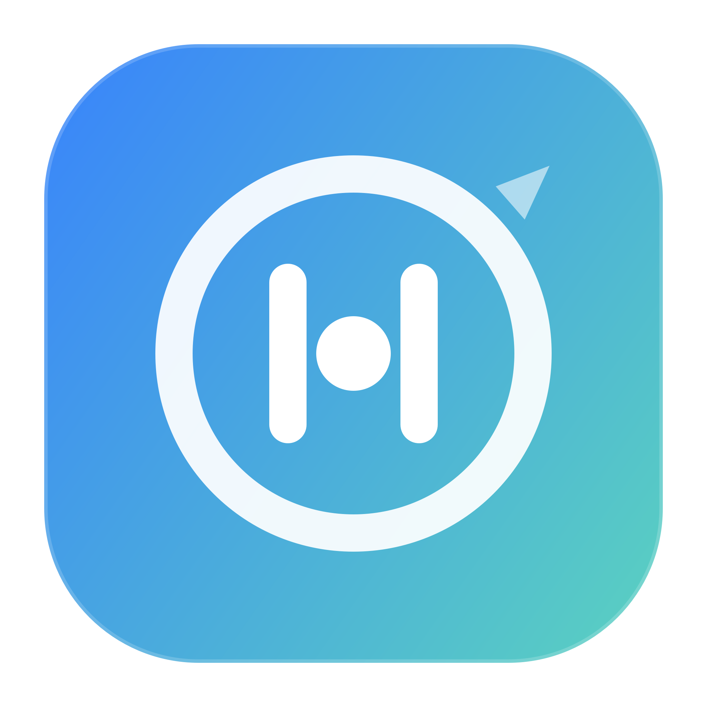

<div align="center">

# StillPoint

**macOS Menu Bar Attention Guardian**

[Website](https://chang-xinhai.github.io/StillPoint/) ·
[Download](https://github.com/chang-xinhai/StillPoint/releases/tag/v0.2.2) ·
[Product Spec](./docs/product-spec.md) ·
[Release Notes](./docs/releasing.md)

<p align="center">
  
</p>

<p align="center">
  
  
  
  
  
</p>

Protect the pause before the feed.

</div>

---

> **Prototype notice**: StillPoint is a research / hackathon prototype. The
> current macOS build demonstrates the intervention loop, menu bar control
> surface, Deep Work Lock, and Daily Attention Receipt. It is not yet a hardened
> anti-bypass system and the public build is not Apple-notarized.

## Features

| Feature | Description |
| --- | --- |
| **Menu bar guardian** | Runs as a no-Dock macOS menu bar utility and keeps watching after the Control Center window is closed. |
| **Foreground app monitoring** | Watches explicit high-risk apps, such as short-video or recommendation-heavy apps, using `NSWorkspace.shared.frontmostApplication`. |
| **Intent checkpoint** | When a watched app crosses the threshold, StillPoint asks for a deliberate choice instead of instantly blocking everything. |
| **Deep Work Lock** | A stricter 3-second checkpoint for coding, build waits, and agent-waiting sessions. |
| **Daily Attention Receipt** | Summarizes the day once, without interrupting after every app exit. |
| **Local-first prototype** | Stores demo state locally and avoids network calls in the core app. |

## Download

The latest demo build is available from GitHub Releases:

[Download StillPoint 0.2.2](https://github.com/chang-xinhai/StillPoint/releases/tag/v0.2.2)

Artifacts:

- `StillPoint-macos-arm64-0.2.2.dmg`
- `StillPoint-macos-arm64-0.2.2.zip`
- SHA256 checksum files for both artifacts

The current release is ad-hoc signed for local validation, but not notarized by
Apple. macOS Gatekeeper may warn after download. For the demo build, use
right-click `Open` if needed. Production distribution should use Developer ID
signing and notarization.

## Quick Start

### Run from source

```bash
git clone https://github.com/chang-xinhai/StillPoint.git
cd StillPoint
./script/build_and_run.sh
```

StillPoint launches as a menu bar agent with no Dock icon and a Control Center
window for demos. Closing the window does not quit the app.

For a launch check:

```bash
./script/build_and_run.sh --verify
```

### Package locally

```bash
./script/package_release.sh
```

This creates a clean `.app` bundle plus zip and DMG artifacts under
`dist/release/`.

## Demo Flow

1. Launch StillPoint.
2. Keep Demo Mode enabled.
3. Open the Control Center and show the live foreground app state.
4. Click `Simulate drift`.
5. Review the full-screen intervention.
6. Choose `Looking something up`, `Intentional break`, or `I drifted`.
7. Open `Daily Receipt` and show the aggregated result.
8. Start `Deep Work Lock` from the menu bar or Control Center.
9. Close the Control Center and show StillPoint continuing from the menu bar.

## How It Works

```text
Frontmost App
     |
     v
Watched App Rules  ---> ignored when not explicitly enabled
     |
     v
Grace / Lock Threshold
     |
     v
Intent Checkpoint
     |
     +--> Purpose pass
     +--> Intentional break
     +--> Close drift
     +--> Start Deep Work Lock
     |
     v
Daily Attention Receipt
```

StillPoint does not try to monitor every app. Work tools such as editors,
terminals, notes, and browsers are not meant to be blocked by default. The core
product idea is narrower: catch the moment when a purposeful visit turns into
unconscious feed consumption.

## Scripts

| Command | Description |
| --- | --- |
| `./script/build_and_run.sh` | Build, bundle, and launch the macOS app. |
| `./script/build_and_run.sh --verify` | Launch and verify the process exists. |
| `./script/test.sh` | Run StillPoint logic tests. |
| `./script/package_release.sh` | Build release artifacts: app bundle, zip, and DMG. |
| `./script/generate_icon.sh` | Regenerate the app icon assets. |

## Current Scope

Implemented:

- macOS SwiftPM app bundle
- menu-bar-first app shape
- Control Center window
- foreground app drift detection
- watched app defaults
- demo intervention overlay
- Deep Work Lock
- Daily Attention Receipt
- local release packaging
- GitHub Pages website

Planned:

- add watched apps from running apps or installed `.app` bundles
- persistent user settings
- English / Chinese language switch
- browser-domain monitoring
- stronger menu bar item behavior inspired by CodexBar
- Android migration for Xiaomi / HyperOS using usage stats, accessibility, and overlay APIs

## Release Validation

For local artifacts:

```bash
codesign --verify --strict --verbose=2 dist/StillPoint.app
spctl -a -t exec -vv dist/StillPoint.app
unzip -l dist/release/StillPoint-macos-*-*.zip | head -40
```

For ad-hoc builds, `codesign --verify` should pass and `spctl` is expected to
reject the app. That is a signing / notarization limitation, not a bundle
assembly failure.

## Related Inspiration

| Project | Why it matters |
| --- | --- |
| [CodexBar](https://github.com/steipete/CodexBar) | A polished macOS menu bar utility with a compact, native status surface. |
| [ScreenZen](https://screenzen.co/) | A humane approach to reducing unintentional phone use. |
| [WxEcho](https://github.com/chang-xinhai/WxEcho) | README and product documentation style reference. |

## License

MIT License

---

<p align="center">
  Made by <a href="https://github.com/chang-xinhai">chang-xinhai</a>
</p>
